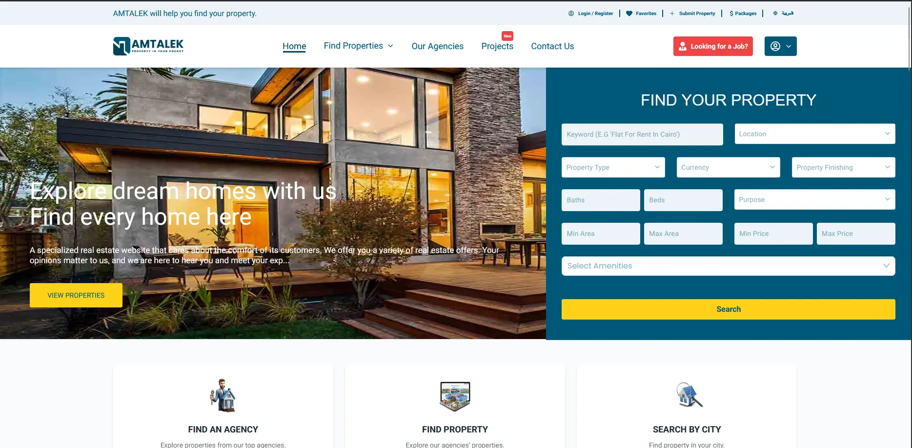
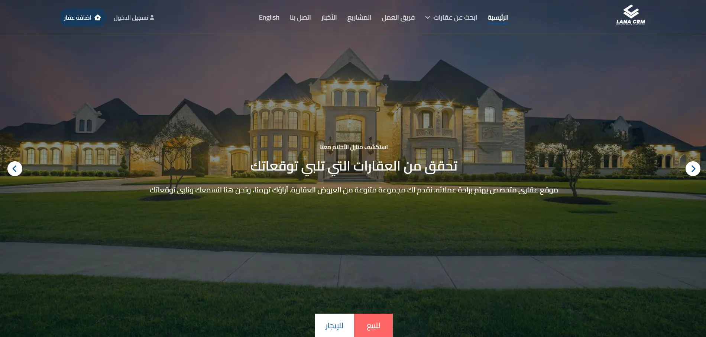
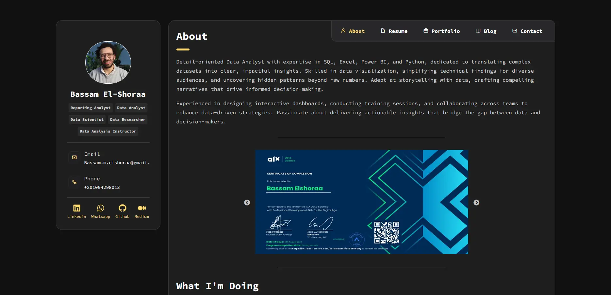
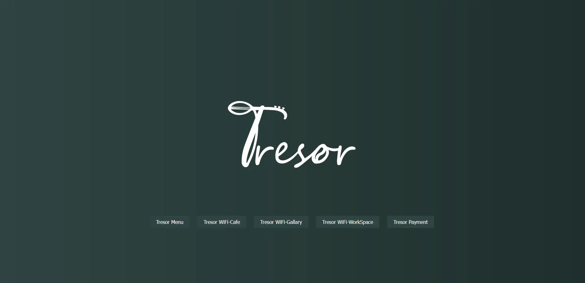

<!--
**Ali-El-Shoraa/Ali-El-Shoraa** is a ✨ _special_ ✨ repository because its `README.md` appears on your GitHub profile.
-->

<!-- ───────────────────── Hero Section ───────────────────── -->

  

<h2 align="center"><strong>Ali El-Shoraa</strong></h2>

  🎯 <strong>Frontend Developer (<u>React.js · Next.js</u>) & Web Scraping</strong>  
   🌍 Cairo, Egypt

<!-- ───────────────────── Contact Links ───────────────────── -->

  
  
  
  
  

---

## 👋 About Me

<!-- - **Automation:** Web-scraping (Puppeteer, Selenium, Cheerio) -->
- **Currently building:** Modern web apps with React.js, Next.js, & TypeScript
- **Looking for:** Collaboration on frontend & automation projects
- **Ask me about:** React, Next.js, JavaScript, TypeScript and Node.js
- **Contact:** [ali.m.elshoraa@gmail.com](mailto:ali.m.elshoraa@gmail.com)

---

## 🏢 Experience

| Company                      | Location     | Role                | Notable Projects           |
|------------------------------|-------------|---------------------|----------------------------|
| E-RAMO For Digital Solutions | Cairo, Egypt| Frontend Developer  | Amtalek, LANA CRM Website  |

---

## 🚀 Featured Projects

| Project      | Overview                                                                          | Tech Stack                                        | Live / Code                        | Preview                               |
|--------------|-----------------------------------------------------------------------------------|---------------------------------------------------|------------------------------------|----------------------------------------|
| **Amtalek**  | Multi-vendor real estate platform; advanced search, i18n, SEO-ready.              | Next.js, Tailwind, TypeScript, TanStack Query, Redux, ShadCn, next-intl, React Hook Form | [Live](https://amtalek.com) |          |
| **LANA CRM** | Single-vendor CRM for real estate; multilingual, new features, bug fixes, mobile friendly. | React.js, react-router-dom, TypeScript, Tailwind, Redux, react-i18n    | [Live](https://demo.lanacrm.com/en)               |    |
| **E-Commerce: Ayo7** | In progress.                                                                       | Next.js, JavaScript, Tailwind, ShadCn, TanStack Query, Zustand, React Hook Form, i18n(next-intl)       | [Live](https://store-smoky-two.vercel.app/en)              |      |
| **Portfolio: Data Analyst** | Portfolio with Medium API for dynamic blogs, interactive design, responsive. | React, JS, Tailwind, Medium API integration       | [Live](https://bassam-portfolio.netlify.app/)              |      |
| **Tresor Café** | Café website; interactive menu, Instapay integration, instant WiFi QR code.    | HTML, CSS, JavaScript                             | [Live](https://treasor-menu.netlify.app/)               |       |

---

## 🛠️ Skills & Technologies

---

## 📊 GitHub Stats

  
  

---

## 🏆 GitHub Trophies

  

